# 🏢 WorkSync - 사내 통합 업무 관리 플랫폼 (그룹웨어)

## 📋 목차

<table>
<tr>
<td><a href="#프로젝트-소개">📌 프로젝트 소개</a></td>
<td><a href="#기술-스택">🛠 기술 스택</a></td>
<td><a href="#핵심-기능-사용자-시나리오-중심">✨ 핵심 기능</a></td>
<td><a href="#서비스-화면">💌 서비스 화면</a></td>
</tr>
<tr>
<td><a href="#api-명세서">📡 API 명세서</a></td>
<td><a href="#시스템-아키텍처">🏗 시스템 아키텍처</a></td>
<td><a href="#프로젝트-구조">🗂 프로젝트 구조</a></td>
<td><a href="#프로젝트-산출물">📜 프로젝트 산출물</a></td>
</tr>
<tr>
<td><a href="#구현-포인트">💡 구현 포인트</a></td>
<td><a href="#트러블슈팅">🔥 트러블슈팅</a></td>
<td><a href="#cicd">🚀 CI/CD</a></td>
<td></td>
</tr>
</table>

---

<a id="프로젝트-소개"></a>

## 📌 프로젝트 소개

🏷 **프로젝트 명 : WorkSync**

🗓 **프로젝트 기간 : 2026.05 ~ 2026.06**

👥 **구성원 : 정소희 · 김태혁 · 이유리 · 김민준 · 유재혁**

---

### ✅ 배포 주소

https://worksync.kr

### ✅ 기획 배경

> "결재, 근태, 게시판, 메신저, 업무 관리... 회사 업무에 필요한 시스템이 따로따로 흩어져 있다면?"

사내에서 자주 쓰이는 업무 도구들이 여러 시스템으로 분산되어 있어 사용이 불편했던 경험에서 출발했습니다.  
전자결재, 근태관리, 게시판, 실시간 메신저, 업무(태스크) 관리, 조직 관리, 알림, 감사 로그까지 한 플랫폼에서 처리할 수 있는 사내 통합 그룹웨어를 직접 구현해보고자 했습니다.  
또한 JWT 인증, Spring Security, WebSocket(STOMP) 기반 실시간 메신저, 동시성 제어, 파일 스토리지 연동 등 실무에서 많이 사용되는 기술을 실제로 통합 구현하는 것을 목표로 삼았습니다.

---

### ✅ 서비스 소개

> 사원이 로그인 하나로 결재 · 근태 · 게시판 · 메신저 · 업무 · 조직 정보를 한 곳에서 관리할 수 있는 사내 통합 업무 플랫폼

- 로그인 후 대시보드에서 **나의 업무 현황을 한눈에 확인**할 수 있다.
- **전자결재** 시스템으로 결재 양식을 선택해 문서를 상신하고, 결재선(검토 → 승인 → 참조)에 따라 처리 흐름을 관리할 수 있다.
- 상신한 문서는 **내 문서함 / 결재함(결재 대기) / 참조함**으로 구분되어 조회된다.
- **연차/반차/병가/경조사/기타** 등 휴가 유형별로 휴가를 신청하고, 결재 문서와 연동되어 처리된다.
- 마이페이지·대시보드에서 **연차 잔여일수**를 조회할 수 있다.
- **출근 / 퇴근 체크인**을 통해 근태를 기록하고, 지각·조퇴·결근 여부가 자동으로 판정된다.
- **공지 / 부서 / 자유 / 자료** 게시판에서 글을 작성하고 첨부파일을 공유할 수 있다.
- WebSocket(STOMP) 기반 **실시간 메신저**로 1:1 / 그룹 채팅을 주고받을 수 있다.
- 채팅방에서 **파일을 첨부·공유**할 수 있고, 채팅방별 참여자 목록과 읽음 처리를 지원한다.
- 업무(Task)를 생성하고 담당자·부서·진행 상태(`TODO`/`IN_PROGRESS`/`DONE`)·진행률로 관리할 수 있다.
- 내 업무, 담당자별 업무, 부서별 업무를 필터링하여 조회할 수 있다.
- 결재 · 업무 · 메신저 이벤트 발생 시 **실시간 알림**을 받고, 안 읽은 알림 수를 확인할 수 있다.
- 파일은 **Supabase Storage**에 업로드되며, 결재 문서·게시글·채팅 등 다양한 참조 대상에 첨부할 수 있다.

---

### 🛠️ 관리자(ROLE_ADMIN) 시나리오

- **조직 관리**: 부서를 생성·수정·삭제하고, 사원을 등록·수정·퇴직 처리할 수 있다.
- 사원 상태(재직 / 휴직 / 퇴직)와 직급, 부서 배정을 관리할 수 있다.
- **감사 로그(Audit Log)** 화면에서 로그인 실패, 결재 처리 등 주요 이벤트를 카테고리·기간·키워드로 검색할 수 있다.
- 감사 로그 상단 통계 위젯에서 **전체 / 오늘 / 로그인 실패 / 결재 처리** 건수를 확인할 수 있다.

---

### 👥 서비스 대상

- 결재 · 근태 · 게시판 · 메신저 · 업무 관리가 한 곳에서 처리되길 원하는 조직
- 사내 시스템을 직접 설계·구축해보고자 하는 학습 목적의 개발자

---

<a id="기술-스택"></a>

## 🛠 기술 스택

### Backend
<p>
  
  
  
  
  
  
  
  
</p>

### Frontend
<p>
  
  
  
  
  
  
</p>

### Database & Build & Deploy
<p>
  
  
  
  
  
  
  
</p>

### Collaboration
<p>
  
  
  
</p>

---

<a id="핵심-기능-사용자-시나리오-중심"></a>

## ✨ 핵심 기능 (사용자 시나리오 중심)

### 👤 일반 사원 시나리오

#### 1단계 — 로그인 / 대시보드
- 사번·비밀번호로 로그인하면 JWT Access/Refresh 토큰이 발급됩니다.
- 로그인 실패가 누적되면 계정이 일정 시간 잠기는 등 보안 정책이 적용됩니다.
- 로그인 후 대시보드에서 결재·업무·근태 등 본인 현황을 한눈에 확인할 수 있습니다.

#### 2단계 — 전자결재
- 결재 양식을 선택해 결재 문서를 작성·상신합니다.
- 결재 문서에는 결재선이 함께 등록되며, 단계별로 `DRAFT`(기안) / `REVIEW`(검토) / `APPROVE`(승인) / `REFERENCE`(참조) 역할이 지정됩니다.
- 본인 차례가 되면 **결재함(`/inbox`)**, 처리해야 할 문서는 **`/pending`**에서 확인 후 승인/반려를 처리합니다.
- 기안자는 진행 중(`IN_PROGRESS`)인 문서만 수정·취소할 수 있습니다.
- 참조자로 지정되면 **참조함(`/reference`)**에서 문서를 열람할 수 있습니다.

#### 3단계 — 휴가 / 연차 관리
- 연차 · 반차 · 병가 · 경조사 · 기타 휴가 유형 중 선택해 휴가를 신청합니다.
- 휴가 신청은 전자결재 문서와 연동되어 결재선을 통해 승인/반려됩니다.
- 연차 잔여일수(총 부여일 - 사용일 - 신청 중인 일수)를 조회할 수 있습니다.

#### 4단계 — 근태 관리
- 출근 시 체크인, 퇴근 시 체크아웃을 기록합니다.
- 출근 시각 기준으로 정상 / 지각 / 조퇴 / 결근 상태가 자동으로 판정됩니다.
- 본인의 근태 기록과 부서별 근태 현황을 조회할 수 있습니다.

#### 5단계 — 게시판
- 공지 / 부서 / 자유 / 자료 게시판별로 글을 작성·수정·삭제할 수 있습니다.
- 게시글에 파일을 첨부하고 다운로드할 수 있습니다.

#### 6단계 — 실시간 메신저
- WebSocket(STOMP) 기반 채팅방에서 1:1 또는 그룹 채팅을 할 수 있습니다.
- 채팅방 입장/퇴장, 읽음 처리, 참여자 목록 조회를 지원합니다.
- 채팅방 내에서 파일을 공유하고 채팅방별 첨부파일 목록을 확인할 수 있습니다.

#### 7단계 — 업무(Task) 관리
- 업무를 생성하고 담당자·부서·마감일·진행률을 지정합니다.
- 업무 상태를 `TODO → IN_PROGRESS → DONE`으로 변경하며 진행 상황을 관리합니다.
- 내가 만든 업무, 내가 담당하는 업무, 특정 담당자/부서의 업무를 필터링하여 조회할 수 있습니다.

#### 8단계 — 알림
- 결재 처리, 업무 할당, 메신저 메시지 등의 이벤트가 발생하면 알림이 생성됩니다.
- 안 읽은 알림 수를 뱃지로 확인하고, 알림을 읽음 처리할 수 있습니다.

---

### 🛠️ 관리자 시나리오 (ROLE_ADMIN)

#### 조직 관리
- 부서를 생성·수정·삭제할 수 있습니다.
- 사원을 등록·수정하고, 재직 / 휴직 / 퇴직 상태를 변경할 수 있습니다.

#### 감사 로그
- 로그인 실패, 결재 처리 등 주요 이벤트 로그를 카테고리·기간·키워드로 검색할 수 있습니다.
- 전체 / 오늘 / 로그인 실패 / 결재 처리 건수를 통계 위젯으로 확인할 수 있습니다.

```
결재 문서 상태 흐름
IN_PROGRESS(진행중) ──→ APPROVED(승인 완료)
                    └──→ REJECTED(반려)

결재선(ApprovalLine) 상태
WAITING(대기) ──→ APPROVED(승인) / REJECTED(반려)
```

---

<a id="서비스-화면"></a>

## 💌 서비스 화면

### ✅ 로그인 / 대시보드

> 로그인 후 나의 결재·업무·근태 현황을 한눈에 확인할 수 있다.

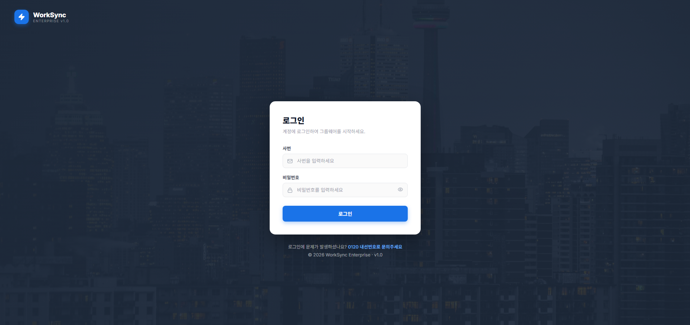
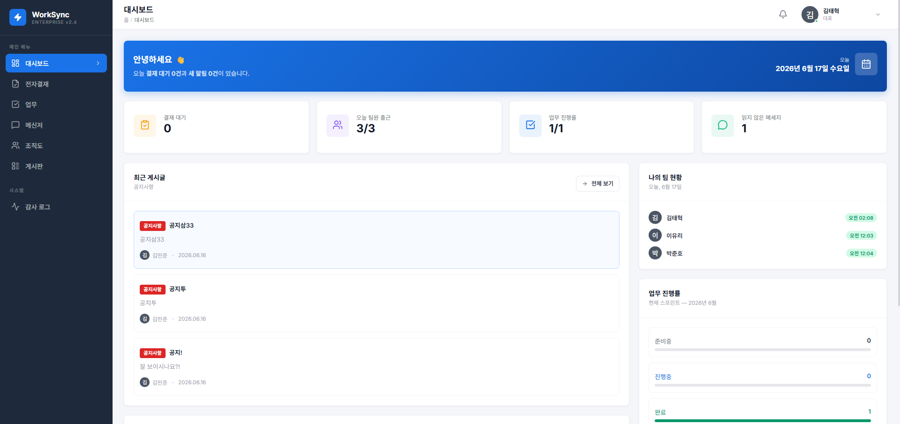

---

### ✅ 전자결재

> 결재 양식을 선택해 문서를 상신하고, 결재선에 따라 승인/반려를 처리할 수 있다.

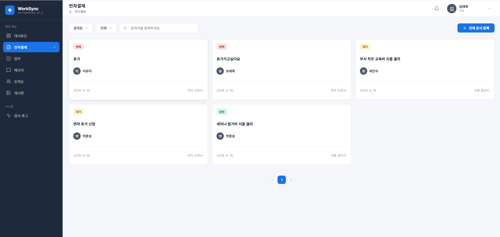
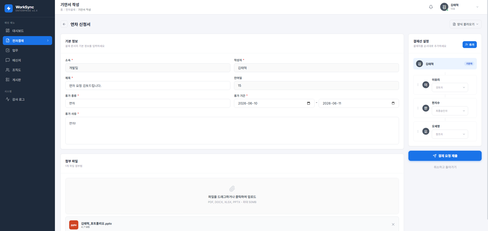

---

### ✅ 게시판

> 공지/부서/자유/자료 게시판에서 글을 작성하고 첨부파일을 공유할 수 있다.

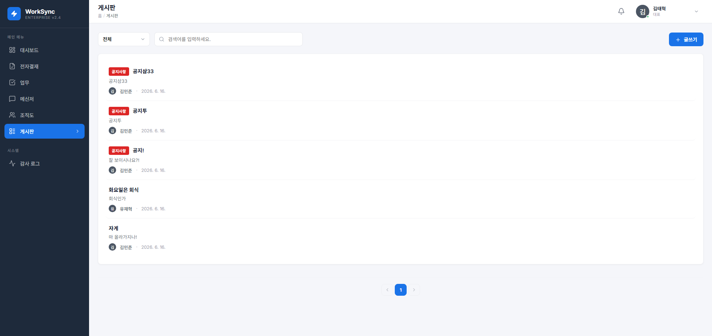

---

### ✅ 메신저

> WebSocket 기반 실시간 1:1 / 그룹 채팅을 지원한다.

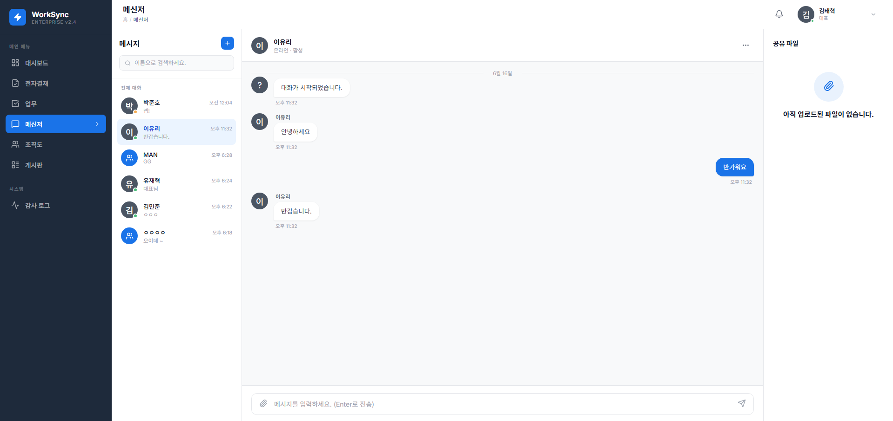

---

### ✅ 업무 관리

> 업무를 생성하고 담당자·진행 상태·진행률로 관리할 수 있다.

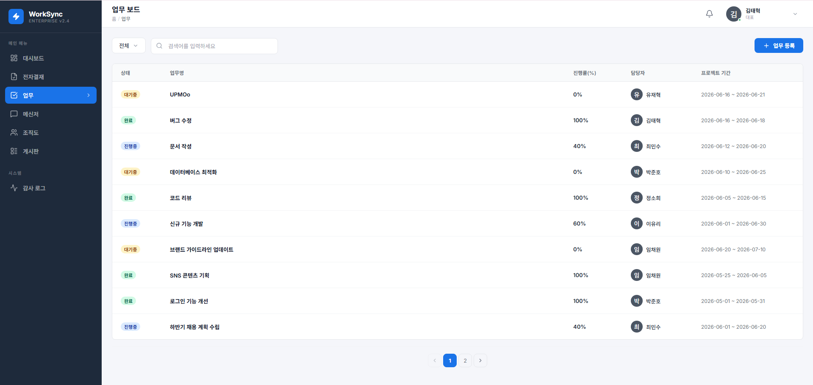
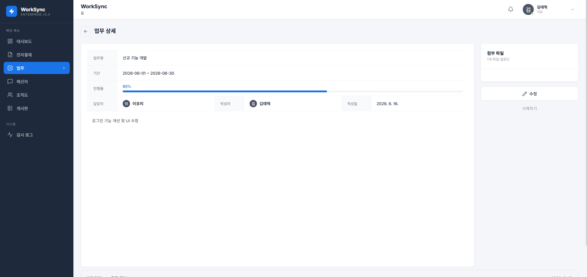

---

### ✅ 조직 관리 / 감사 로그 (관리자)

> 부서·사원을 관리하고, 주요 이벤트를 감사 로그로 확인할 수 있다.

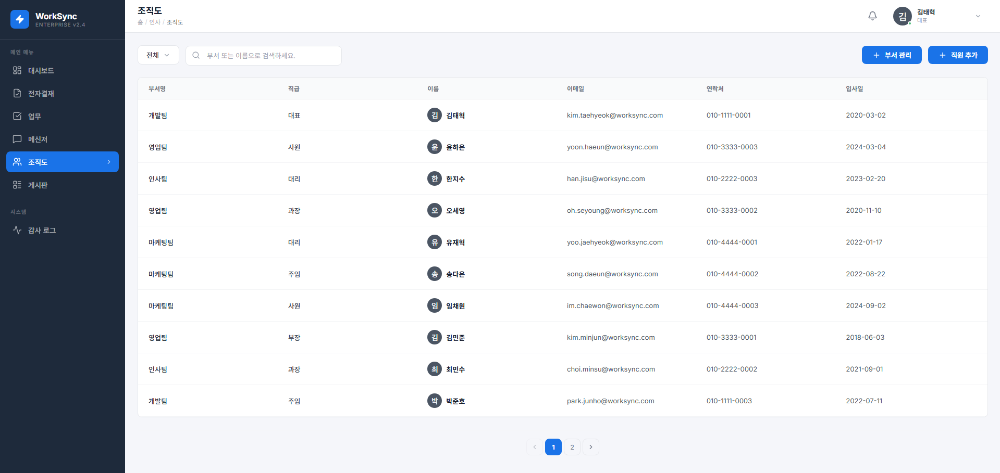
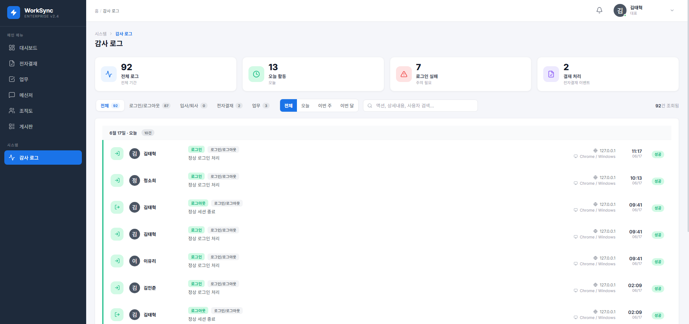

---

<a id="api-명세서"></a>

## 📡 API 명세서

[📋 API 명세서 보기 (PDF)](API_명세서.pdf)

> 위 링크를 클릭하면 도메인별 API 목록이 정리된 PDF 파일이 열립니다.  
> 13개 도메인 · 70여 개 엔드포인트 · 부록(오류코드 · ENUM · 컨트롤러 목록) 포함

---

<a id="시스템-아키텍처"></a>

## 🏗 시스템 아키텍처


---

<a id="프로젝트-구조"></a>

## 🗂 프로젝트 구조

```
backend/src/main/java/com/worksync/
├── domain/
│   ├── auth/           # 로그인 / 토큰 발급·재발급
│   ├── employee/       # 사원 정보 / 권한(USER, ADMIN) / 상태
│   ├── department/     # 부서 관리
│   ├── approval/       # 결재 양식 / 문서 / 결재선 / 결재 처리
│   ├── leave/          # 휴가 신청 / 연차 잔여일수
│   ├── attendance/     # 출퇴근 체크 / 근태 상태
│   ├── task/           # 업무(Task) 생성·조회·수정·삭제
│   ├── board/          # 게시판 / 게시글
│   ├── chat/           # 채팅방 / 채팅 멤버 / 메시지 (WebSocket·STOMP)
│   ├── file/           # 파일 업로드·조회·삭제 (Supabase Storage)
│   ├── notification/   # 알림 생성·조회·읽음 처리
│   └── audit/          # 감사 로그 (관리자)
│
└── global/
    ├── config/         # Security, JWT, WebSocket(STOMP), CORS, Swagger 설정
    ├── security/        # JWT 인증 필터 / UserDetails
    ├── exception/       # 전역 예외 처리
    └── response/         # 공통 API 응답 포맷

frontend/src/
├── api/                 # axios 인스턴스 / API 클라이언트
├── components/
│   ├── common/         # 공통 컴포넌트
│   ├── layout/         # 레이아웃 (네비게이션 등)
│   └── service/        # 서비스 공통 컴포넌트
├── domains/
│   ├── auth/            # 로그인
│   ├── dashboard/       # 대시보드
│   ├── approval/        # 전자결재
│   ├── board/           # 게시판
│   ├── chat/            # 메신저
│   ├── task/            # 업무 관리
│   ├── organization/    # 조직(부서/사원) 관리
│   ├── notification/    # 알림
│   ├── audit/           # 감사 로그
│   └── file/            # 파일 업로드/조회
├── routes/              # 라우팅 설정 (AppRouter)
├── store/               # 전역 상태 (AuthContext 등)
└── styles/              # 전역 스타일
```

---

<a id="프로젝트-산출물"></a>

## 📜 프로젝트 산출물

### ERD

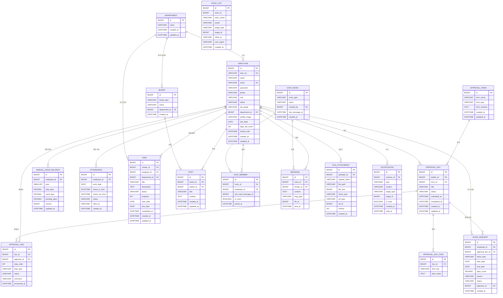

---

<a id="구현-포인트"></a>

## 💡 구현 포인트

**JWT Stateless 인증 + 계정 잠금**  
세션을 사용하지 않고 매 요청마다 헤더의 JWT 토큰을 검증하는 Stateless 방식으로 구현했습니다.  
`JwtAuthenticationFilter`에서 토큰 유효성을 검사해 `SecurityContext`에 인증 정보를 저장하며, 로그인 실패 횟수(`login_fail_count`)가 누적되면 일정 시간 계정을 잠그는(`locked_until`) 보안 정책을 적용했습니다.

**결재선(ApprovalLine) 기반 전자결재**  
결재 문서(`ApprovalDoc`) 하나에 여러 결재선(`ApprovalLine`)을 두고, `step_order`와 `step_type`(DRAFT / REVIEW / APPROVE / REFERENCE)으로 처리 순서와 역할을 구분했습니다.  
현재 로그인한 사원을 기준으로 내 문서함(`/my`), 결재함(`/inbox`), 결재 대기(`/pending`), 참조함(`/reference`)을 분리하여 조회할 수 있도록 설계했습니다.

**휴가-결재 연동 및 연차 동시성 제어**  
휴가 신청(`LeaveRequest`)은 전자결재 문서와 연동되어 결재선을 통해 승인/반려됩니다.  
연차 잔여일수(`AnnualLeaveBalance`)는 총 부여일 / 사용일 / 신청 중인 일수를 분리 관리하며, 동시 신청 시 데이터 정합성을 보장하기 위해 버전(`version`) 기반 동시성 제어를 적용했습니다.

**WebSocket(STOMP) 기반 실시간 메신저**  
일반 HTTP 요청과 달리 WebSocket은 Spring Security 필터를 거치지 않기 때문에, STOMP 연결 시 `StompHandler`에서 JWT 토큰을 직접 검증하는 방식으로 인증을 처리했습니다.  
채팅방(`ChatRoom`) - 채팅 멤버(`ChatMember`) - 메시지(`Message`) 구조로 1:1 / 그룹 채팅을 지원하며, `last_read_message_id`로 읽음 처리를 관리합니다.

**근태 자동 상태 판정**  
출근(`check-in`) / 퇴근(`check-out`) 기록을 바탕으로 정상(`NORMAL`) / 지각(`LATE`) / 조퇴(`EARLY_LEAVE`) / 결근(`ABSENT`) 상태를 자동으로 판정하여 저장합니다.

**파일 첨부 - Supabase Storage 연동**  
파일은 Supabase Storage에 업로드되고, `FileAttachment` 엔티티의 `ref_type`(APPROVAL / TASK / CHAT / POST / DEPARTMENT / EMPLOYEE / BOARD)과 `ref_id`로 어떤 도메인의 어떤 데이터에 첨부된 파일인지 구분합니다.

**감사 로그(Audit Log) 기반 운영 모니터링**  
로그인 실패, 결재 처리 등 주요 이벤트를 `AuditLog`에 기록하고, 관리자는 카테고리·기간·키워드로 검색하거나 통계 위젯(전체/오늘/로그인 실패/결재 처리)으로 한눈에 확인할 수 있습니다.

---

<a id="트러블슈팅"></a>

## 🔥 트러블슈팅

### 1. 프론트엔드 API URL 하드코딩 문제 (localhost:8080)

**문제**  
로컬 개발 환경에서 `http://localhost:8080/api`로 하드코딩된 API 주소가 14개 파일에 산재해 있어, 배포 후 프론트엔드가 서버 API 대신 로컬호스트로 요청을 보내는 문제가 발생했습니다.

**해결**  
Nginx에서 `/api` 경로를 백엔드(localhost:8080)로 프록시하도록 설정하고, 프론트엔드의 모든 `BASE_URL`을 `/api`(상대 경로)로 통일했습니다.

```js
// Before
const BASE_URL = "http://localhost:8080/api";

// After
const BASE_URL = "/api";
```

---

### 2. WebSocket CORS 오류 (403 Forbidden)

**문제**  
배포 후 WebSocket(STOMP) 연결 시 403 에러가 발생했습니다. 실시간 메신저, 알림 등 WebSocket 기반 기능이 전혀 동작하지 않았습니다.

**원인**  
`WebSocketConfig`의 `setAllowedOrigins`가 환경변수 `FRONTEND_URL`을 참조하는데, 서버에 설정된 값이 `http://3.39.166.21:5173`(개발용)으로 남아 있어 `https://worksync.kr`에서 보내는 요청이 차단됐습니다.

**해결**  
systemd 서비스 파일의 환경변수를 실제 도메인으로 수정했습니다.

```
FRONTEND_URL=https://worksync.kr
```

---

### 3. Nginx 정적 파일 권한 오류 (500 Internal Server Error)

**문제**  
배포 후 사이트 접속 시 500 에러가 발생했습니다. Nginx 에러 로그에 `Permission denied`가 찍혀 있었습니다.

**원인**  
Nginx 프로세스가 `/home/ubuntu` 디렉토리에 접근할 권한이 없어 프론트엔드 빌드 결과물(`dist/`)을 읽지 못했습니다.

**해결**  
홈 디렉토리 및 빌드 디렉토리에 실행 권한을 부여했습니다.

```bash
sudo chmod 755 /home/ubuntu
sudo chmod -R 755 /home/ubuntu/WorkSync/frontend/dist
```

---

### 4. GitHub Actions 빌드 타임아웃

**문제**  
초기 CI/CD 구성 시 EC2 서버에서 직접 빌드(`./gradlew build`)를 실행했더니 메모리 부족(OOM)으로 프로세스가 강제 종료되거나, 빌드 시간이 10분을 초과해 타임아웃이 발생했습니다.

**해결**  
빌드를 EC2가 아닌 GitHub Actions 러너에서 수행하고, 완성된 JAR 파일과 프론트엔드 빌드 결과물만 SCP로 서버에 전송하는 방식으로 전환했습니다.

```
GitHub Actions Runner
  ├─ ./gradlew build -x test  → worksync.jar 생성
  ├─ npm run build             → dist/ 생성
  └─ SCP → EC2 전송 → systemd restart
```

---

### 5. 로그인 계정 잠금 문제

**문제**  
테스트 중 비밀번호를 여러 번 틀려 계정이 잠기는 현상이 발생했습니다. (`locked_until` 컬럼에 미래 시각이 저장되어 로그인 불가)

**해결**  
Supabase에서 직접 잠금 상태를 초기화했습니다.

```sql
UPDATE employee SET locked_until = NULL, login_fail_count = 0;
```

---

### 6. 메신저 대화 목록 실시간 갱신 안 됨

**문제**  
새 메시지가 도착해도 왼쪽 대화 목록에 즉시 반영되지 않고 새로고침을 해야 나타났습니다. 메시지 내용은 WebSocket으로 실시간 수신되는데 대화 목록은 갱신되지 않았습니다.

**원인**  
대화 목록은 페이지 최초 로드 시 1회만 API로 불러오고, WebSocket의 unread 이벤트 핸들러가 기존 방의 안읽음 수만 업데이트할 뿐 새 방을 목록에 추가하는 로직이 없었습니다.

**해결**  
unread 이벤트 수신 시 목록에 없는 `roomId`가 감지되면 대화 목록 전체를 재조회하도록 수정했습니다.

```js
setConversation((prev) => {
  const exists = prev.some((conv) => conv.id === roomId);
  if (!exists) {
    getChatRoom(accessToken).then((data) => {
      setConversation(Array.isArray(data.data) ? data.data : []);
    });
    return prev;
  }
  return prev.map((conv) =>
    conv.id === roomId ? { ...conv, unreadCount } : conv
  );
});
```

---

<a id="cicd"></a>

## 🚀 CI/CD

GitHub Actions를 활용하여 `main`, `dev-backend`, `dev-frontend` 브랜치에 push / PR 시 빌드를 자동으로 검증하도록 구성했습니다.

```
push / PR (main, dev-backend, dev-frontend)
    ↓
GitHub Actions 워크플로우 실행
    ├─ Backend: JDK 21 설정 → ./gradlew build
    └─ Frontend: Node 20 설정 → npm ci → npm run build
```

- 백엔드/프론트엔드 빌드를 병렬로 검증하여 머지 전 빌드 깨짐을 조기에 발견합니다.
- `docker-compose.yml`로 백엔드(8080) / 프론트엔드(Nginx, 5173) 컨테이너를 함께 구성할 수 있습니다.
